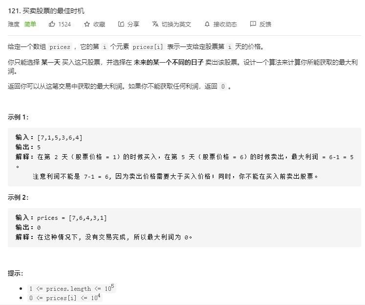

# best_time_to_buy_and_sell_stock

## 题目截图
 

## 思路 遍历

- 时间复杂度：`O(N)`:遍历数组
- 空间复杂度：`O(1)`:常数个变量

    class Solution:
    def maxProfit(self, prices: List[int]) -> int:
        # 遍历，记录当前最小买入点索引及最大利润
        minist, profit = prices[0], 0
        for i in range(1,len(prices)):
            if prices[i] < minist:
                minist = prices[i]
            profit = max(profit, prices[i] - minist)
        return profit
