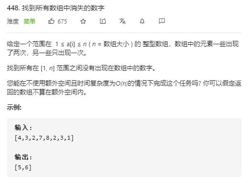

# find_all_numbers_disappeared_in_an_array

## 题目截图
 

## 思路一 一个萝卜一个坑

将各自元素放入各自的位置，若该位置已有相应元素，则将该元素置为0

    class Solution:
    def findDisappearedNumbers(self, nums: List[int]) -> List[int]:
        # 遍历，将元素放进各自的位置
        res = []
        for i in range(len(nums)):
            if nums[i] == 0: continue
            while nums[i] != i + 1 and nums[i] != 0:
                if nums[i] == nums[nums[i] - 1]:
                    nums[i] = 0
                else:
                    tmp = nums[i]
                    nums[i] = nums[tmp - 1]
                    nums[tmp - 1] = tmp
        for i in range(len(nums)):
            if nums[i] == 0:
                res.append(i + 1)
        return res

## 思路二  原地修改

该法算是比较巧妙，思想可借鉴用于解决类似问题

由于所有元素范围都在 `[1, n]`, 故可遍历元素，将每个元素 `x` 对应的位置元素 `nums[x - 1] += n` , 这样第二次遍历时只需要在对应位置中元素 `<=n` 的即是未出现过的数字。

注意后面遍历的元素可能已经大于 `n`,故需要取模

    class Solution:
        def findDisappearedNumbers(self, nums: List[int]) -> List[int]:
            n, res = len(nums), []
            for num in nums:
                tmp = (num - 1) % n
                nums[tmp] += n
            for i, x in enumerate(nums):
                if x <= n:
                    res.append(i + 1)
            return res
