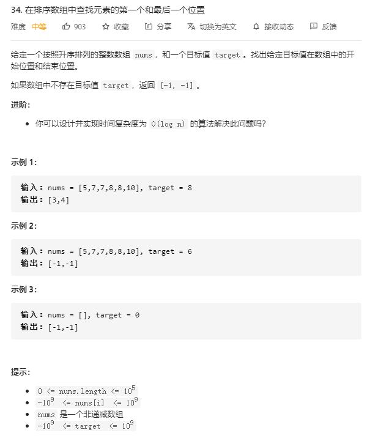

# find_first_and_last_position_of_element_in_sorted_array

## 题目截图
 

## 思路 二分查找

两次二分查找，分别查找 target 的下界(第一个出现的位置)和上界(最后出现的后一个位置)

二分查找小 trick: 采用前闭后开区间 [i, j)

    class Solution:
    def searchRange(self, nums: List[int], target: int) -> List[int]:
        # 两次二分查找
        # 一次查上界一次查下界

        # 查询下界
        i, j = 0, len(nums)
        while i < j:
            m = i + (j - i) // 2
            if nums[m] >= target:
                j = m
            else:
                i = m + 1
        low = i
        # 查询上界
        i, j = 0, len(nums)
        while i < j:
            m = i + (j - i) // 2
            if nums[m] > target:
                j = m
            else:
                i = m + 1
        high = i
        return [low, high - 1] if low < high else [-1, -1]

        
            

        
