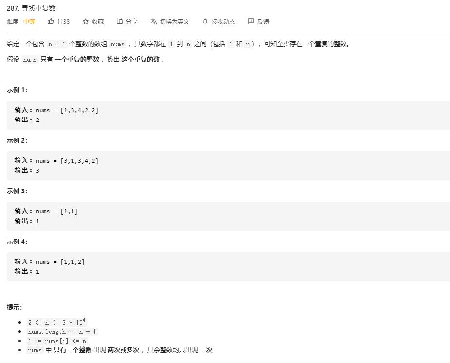

# find_the_duplicate_number

## 题目截图
 

## 思路 一个萝卜一个坑

由于数字都在 `1` 到 `n` 之间，故可将元素 `x` 放置在相应位置即第 `x - 1` 的位置:
- 若 `x - 1` 位置的元素已经放置了该元素，则直接 `return x`
- 若非该元素，则将该元素放回 `x` 的位置继续判断

- 时间复杂度： `O(N)` ? 因为每个元素只换一次位置
- 空间复杂度： `O(1)` 常数个辅助变量

    class Solution:
    def findDuplicate(self, nums: List[int]) -> int:
        for i, x in enumerate(nums):
            while x != i + 1:
                if x == nums[x - 1]:
                    return x
                else:
                    tmp = nums[x - 1]
                    nums[x - 1] = x
                    x = tmp
                    nums[i] = x
        return -1
