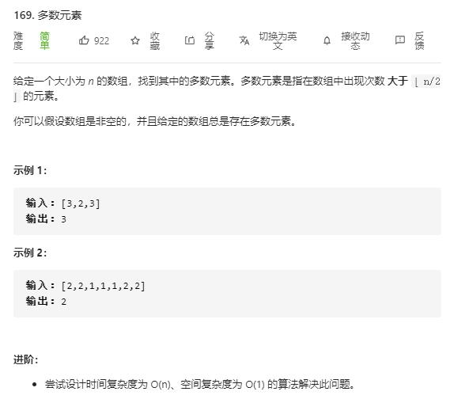

# majority_element

## 题目截图
 

## 思路 摩尔投票
- 时间复杂度： `O(n)`,遍历一遍元素
- 空间复杂度： `O(n)`,遍历一遍元素

    class Solution:
    def majorityElement(self, nums: List[int]) -> int:
        # 摩尔投票
        res, vote = nums[0], 0
        for num in nums:
            if num == res:
                vote += 1
            else:
                vote -= 1
            if vote < 0:
                res = num
                vote = 1
        return res

