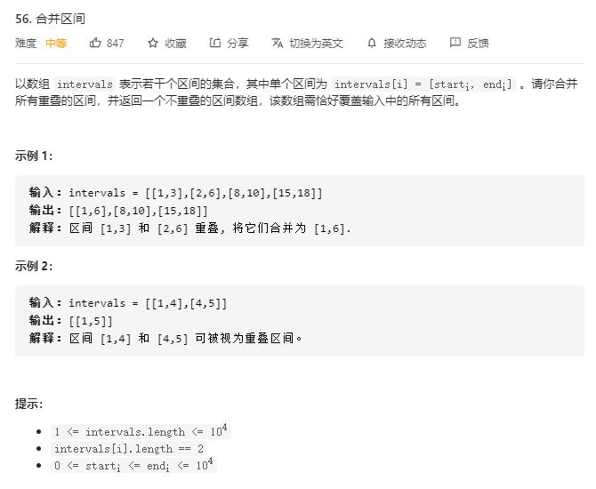

# merge_intervals

## 题目截图
 

## 思路 排序

先根据 `start` 的值进行排序

遍历 `intervals`：
- 如果 `res` 为空或者当前起始编号大于末尾区间的 `end`,则将当前区间元素加入 `res`
- 若当前起始编号小于等于末尾区间的 `end`,则说明重叠，更新末尾区间的值`
max(res[-1][1], interval[1])`

    class Solution:
    def merge(self, intervals: List[List[int]]) -> List[List[int]]:
        # 排序 + 合并
        intervals.sort(key = lambda x: x[0])
        res = [] 
        for interval in intervals:
            if not res or interval[0] > res[-1][1]:
                # 如果 res 为空或者当前起始编号大于末尾区间的 end
                res.append(interval)
            else:
                # 若当前起始编号小于等于末尾区间的 end,则说明重叠，更新末尾区间
                res[-1][1] = max(res[-1][1], interval[1])
        return res
