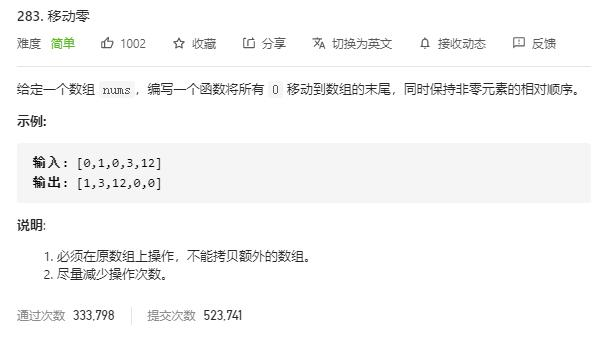

# move_zeroes

## 题目截图
 

## 思路 遍历

    class Solution:
    def moveZeroes(self, nums: List[int]) -> None:
        """
        Do not return anything, modify nums in-place instead.
        """
        # 第一轮遍历，记录 0 的个数,并把非 0 元素移至相应位置
        count = 0
        for i in range(len(nums)):
            if nums[i] == 0:
                count += 1
            else:
                nums[i - count] = nums[i]
        # 第二轮遍历，将末尾 count 个元素置为 0 
        for i in range(len(nums) - count, len(nums)):
            nums[i] = 0
        
