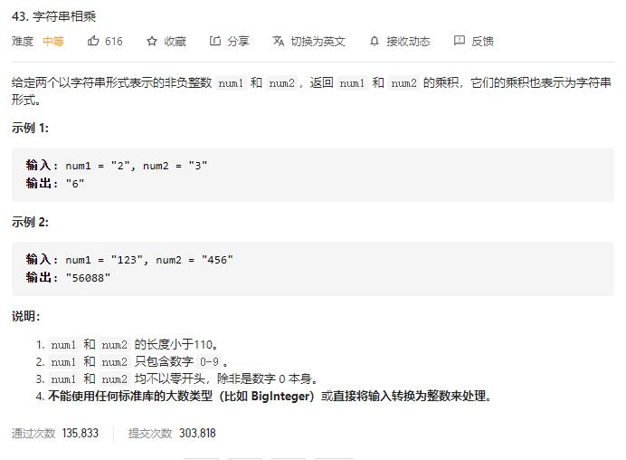

# multiply_strings

## 题目截图
 

## 思路 

    class Solution:
        def multiply(self, num1: str, num2: str) -> str:
            if num1 == "0" or num2 == "0":
                return "0"
            m, n = len(num1), len(num2)
            res = "0"
            for j in range(n - 1, -1, -1):
                cur = ["0"] * (n - j - 1)
                # add 保存进位
                n2, add = int(num2[j]), 0
                for i in range(m - 1, -1, -1):
                    product = n2 * int(num1[i]) + add
                    cur.append(str(product % 10))
                    add = product // 10
                if add > 0:
                    cur.append(str(add))
                cur = "".join(cur[::-1])
                res = self.add_strings(res, cur)
            return res
            
        def add_strings(self, s1, s2):
            res = []
            # add 保存进位
            add, m, n = 0, len(s1) - 1, len(s2) - 1
            while m >=0 or n >= 0 or add != 0:
                s =add
                if m >= 0:
                    s += int(s1[m])
                    m -= 1
                if n >= 0:
                    s += int(s2[n])
                    n -= 1
                res.append(str(s % 10))
                add = s // 10
            return "".join(res[::-1])
        
