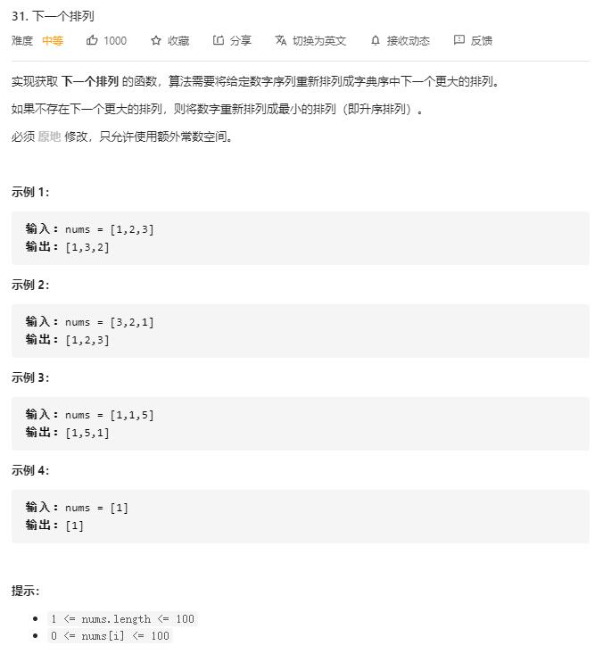

# next_permutation

## 题目截图
 

## 思路 

思考：如何找到下一个排列？

1. 从后往前首先找到首个相邻升序元素 nums[i], nums[j], 此时数列末尾几个数[j : end] 是降序的
2. 将末尾几个数中首个比 nums[i] 大的数(即尽可能小的数) 与nums[i]交换
3. 可断定此时[i + 1 : end]为逆序，将末尾几个数逆置即可
边界条件： 若未找到相邻升序元素，则将整个序列逆序

    class Solution:
    def nextPermutation(self, nums: List[int]) -> None:
        """
        Do not return anything, modify nums in-place instead.
        """
        i, j = len(nums) - 2, len(nums) - 1
        while i >= 0:
            if nums[i] < nums[j]:
                k = j
                while k < len(nums):
                    if nums[i] < nums[k]:
                        k += 1
                    else:
                        break
                nums[i], nums[k - 1] = nums[k - 1], nums[i]
                break
            else:
                i -= 1
                j -= 1
        i, j = j, len(nums) - 1
        while i < j:
            nums[i], nums[j] = nums[j], nums[i]
            i += 1
            j -= 1
        
