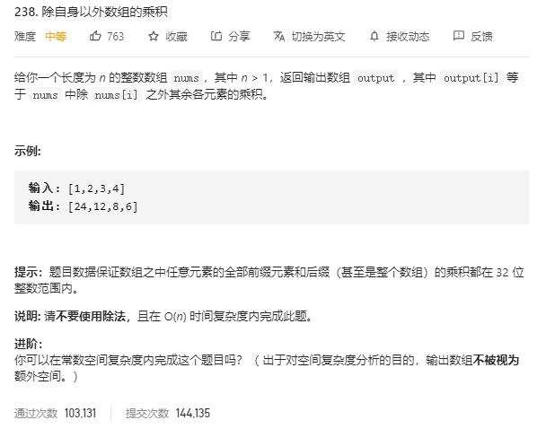

# product_of_array_except_self

## 题目截图
 

## 思路 遍历
从左至右和从右至左两轮遍历将元素叠乘
- 时间复杂度： `O(n)` ,两次遍历
- 空间复杂度： `O(1)` ,常数个变量

    class Solution:
    def productExceptSelf(self, nums: List[int]) -> List[int]:
        # 两轮遍历
        res = [1] * len(nums)
        # 从左至右遍历
        for i in range(1, len(nums)):
            res[i] = res[i - 1] * nums[i - 1]
        tmp = nums[-1]
        for i in range(len(nums) - 2, -1,  -1):
            res[i] = res[i] * tmp
            tmp *= nums[i]
        return res
