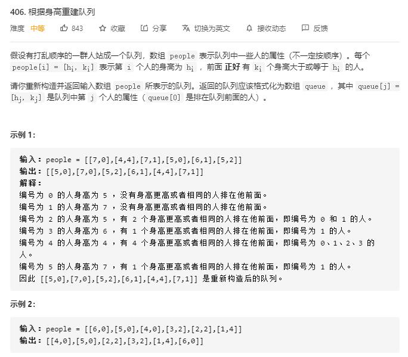

# queue_reconstruction_by_height

## 题目截图
 

## 思路 排序

    class Solution:
        def reconstructQueue(self, people: List[List[int]]) -> List[List[int]]:
            people = sorted(people, key = lambda x: (-x[0], x[1]))
            # 根据当前排列与 k 的值确定其最终的位置
            res = []
            for p in people:
                if len(res) <= p[1]:
                    res.append(p)
                else:
                    res.insert(p[1], p)
            return res