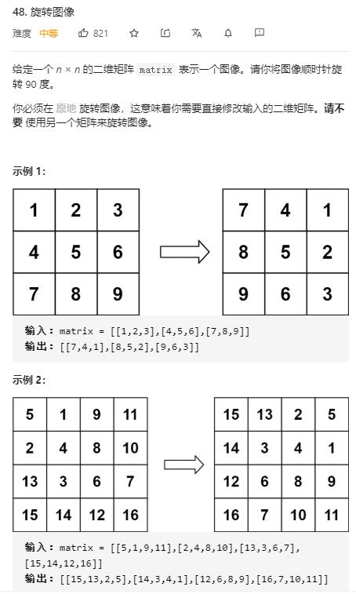

# rotate_image

## 题目截图
 

## 思路 原地旋转

寻找旋转的规律

设矩形的宽为 `n` 

仔细观察后易得第 `i` 行元素经旋转后位置为倒数第 `i` 列，即第 `n - 1 - i` 行

第 `j` 列经旋转后在第 `j` 行

并且是相对应的四个元素进行顺时针方向的交换

元素 `matrix[row][col]` 经过旋转后位置为 `matrix[col][n - 1 - row]`。

故位置变换为：

`matrix[i][j]` ==> `matrix[j][n - 1 - i]`

`matrix[j][n - 1 - i]` ==> `matrix[n - i - 1][n - j - 1]`

`matrix[n - i - 1][n - j - 1]` ==> `matrix[n - j - 1][i]`

`matrix[n - j - 1][i]` ==> `matrix[i][j]`

    class Solution:
    def rotate(self, matrix: List[List[int]]) -> None:
        """
        Do not return anything, modify matrix in-place instead.
        """
        n = len(matrix)
        for i in range(n // 2):
            for j in range((n + 1) // 2):
                matrix[j][n - i - 1], matrix[n - i - 1][n - j - 1], matrix[n - j - 1][i], matrix[i][j] = matrix[i][j], matrix[j][n - i - 1], matrix[n - i - 1][n - j - 1], matrix[n - j - 1][i]
