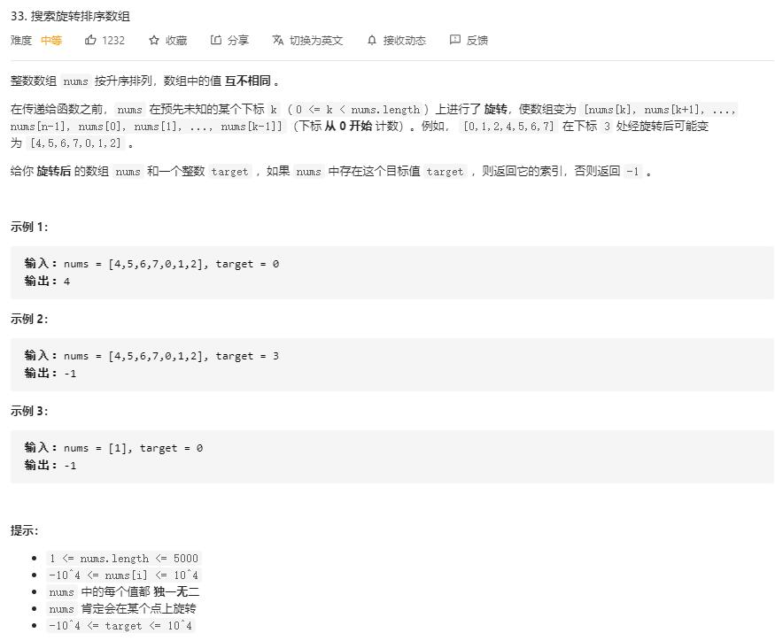

# Two_Sum

## 题目截图
 

## 思路 二分查找

因为是两个有序数列
取中点 `m = i + (j - i) // 2`,并让 `m` 与 `j` 进行比较：
- 若 `nums[m]` > `nums[j]`，则左边为有序，判断 `target` 是否在左边，缩小查询区域
- 若 `nums[m]` < `nums[j]`，则右边为有序，判断 `target` 是否在右边，缩小查询区域

    class Solution:
    def search(self, nums: List[int], target: int) -> int:
        # 采用二分查找
        # 首先 j 指针的值肯定在右子序列中
        # m = i + (j - i) // 2
        # if nums[m] > nums[j]:  m 位于左子序列，
        # if nums[m] < nums[j]:  m 位于右子序列
        # 比较 nums[m] 与 target 的大小
        # 根据 target 与有序部分比较确定 target 可能在哪部分
        i, j = 0, len(nums)
        while i < j:
            m = i + (j - i) // 2
            if nums[m] == target: return m
            if nums[m] > nums[j - 1]:
                if nums[i] <= target < nums[m]:
                    j = m
                else:
                    i = m + 1
            else:
                # 右边肯定为有序的
                if nums[m] < target <= nums[j - 1]:
                    i = m + 1
                else:
                    j = m
        return -1
        
