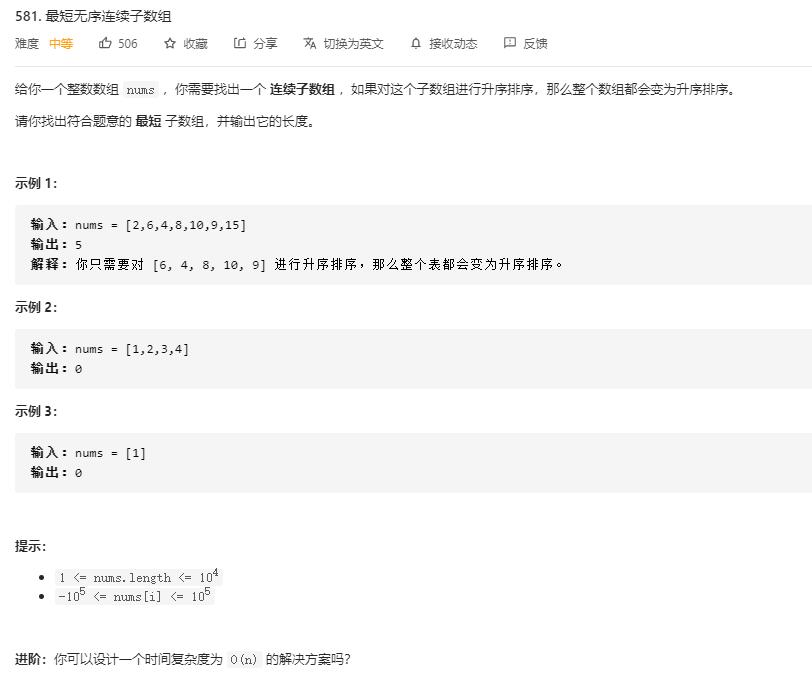

# shortest_unsorted_continuous_subarray

## 题目截图
 

## 思路一 双重循环遍历

理清思路：

要寻找的其实逆序数组的边界

故可进行双重循环，寻找逆序数组，并找到其最大边界

- 时间复杂度:`O(N^2)`,双重循环
- 空间复杂度：`O(N)`

    class Solution:
    def twoSum(self, nums: List[int], target: int) -> List[int]:
        dic = {}
        for i, num in enumerate(nums):
            if (target - num) in dic:
                return[dic[target - num], i]
            dic[num] = i
        return []

# 思路二 排序

将数组排序，然后对比左右哪个位置元素不对

    class Solution:
        def findUnsortedSubarray(self, nums: List[int]) -> int:
            num_s = sorted(nums)
            l = len(nums)
            for i, x in enumerate(num_s):
                if x != nums[i]:
                    l = i
                    break
            if l == len(nums):
                return 0
            for j in range(len(nums) - 1, -1, -1):
                if nums[j] != num_s[j]:
                    r = j
                    break
            return j - i + 1

# 思路三 遍历

其实此题的答案就是要找到逆序数组的左右两个边界，

而左边界由逆序数组中最小值决定，右边界由逆序数组中最大值决定

所以可采用两轮遍历

第一轮遍历找到逆序数组中的最大值和最小值

第二轮找到最小值最大值应该在的位置,即从左到右第一个大于最小值的位置和从右到左第一个小于最大值的元素位置

- 时间复杂度：`O(N)`,两次遍历
- 空间复杂度：`O(1)`,常数个变量

    class Solution:
        def findUnsortedSubarray(self, nums: List[int]) -> int:
            imin, imax = float("inf"), float("-inf")
            for i in range(len(nums) - 1):
                if nums[i] > nums[i + 1]:
                    imin = min(nums[i + 1], imin)
                    imax = max(nums[i], imax)
            if imin > imax:
                return 0
            l, r = 0, len(nums) - 1
            while nums[l] <= imin:
                l += 1
            while nums[r] >= imax:
                r -= 1
            return r - l + 1
