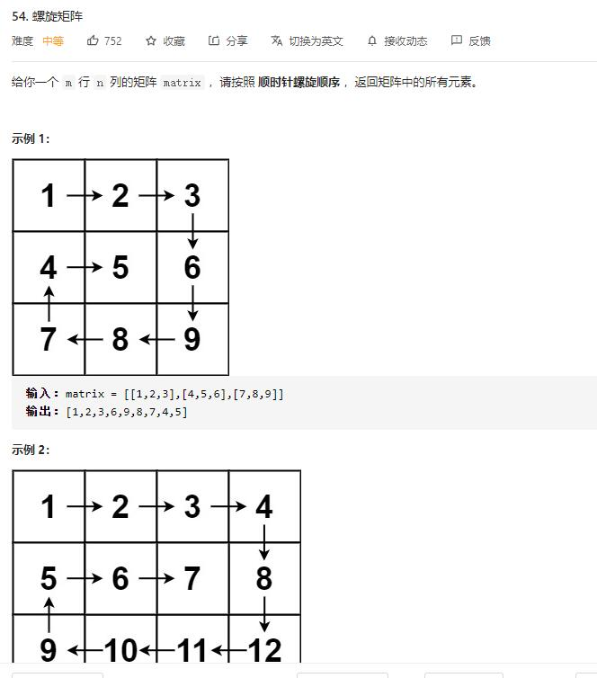

# spiral_matrix

## 题目截图
 

## 思路 设定边界

    class Solution:
    def spiralOrder(self, matrix: List[List[int]]) -> List[int]:
        order = [[0, 1], [1, 0], [0, -1], [-1, 0]]
        row, column = len(matrix), len(matrix[0])
        # 定义边界
        left, right, up, down = 0, column - 1, 0, row - 1
        index, m, n, res = 0, 0, 0, []
        while len(res) < row * column:
            res.append(matrix[m][n])
            # 尝试走一步
            tmp_m = m + order[index][0]
            tmp_n = n + order[index][1]
            # 若超出边界则调整方向
            if tmp_n < left or tmp_n > right or tmp_m < up or tmp_m > down:
                if index == 0:
                    up += 1
                elif index == 1:
                    right -= 1
                elif index == 2:
                    down -= 1
                elif index == 3:
                    left += 1
                index = (index + 1) % 4
            m += order[index][0]
            n += order[index][1]
        return res

