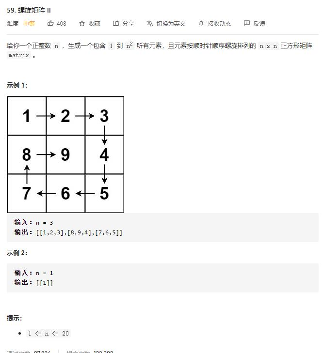

# spiral_matrix_II

## 题目截图
 

## 思路 设定边界

    class Solution:
    def generateMatrix(self, n: int) -> List[List[int]]:
        order = [[0, 1], [1, 0], [0, -1], [-1, 0]]
        left, right, top, bottom = 0, n - 1, 0, n - 1
        res, r, c, count, index = [[0 for _ in range(n)] for _ in range(n)], 0, 0, 1, 0
        while count <= n * n:
            res[r][c] = count
            count += 1
            tmp_r = r + order[index][0]
            tmp_c = c + order[index][1]
            if tmp_r < top or tmp_r > bottom or tmp_c < left or tmp_c > right:
                if index == 0:
                    top += 1
                if index == 1:
                    right -= 1
                if index == 2:
                    bottom -= 1
                if index == 3:
                    left += 1
                index = (index + 1) % 4
            r += order[index][0]
            c += order[index][1]
        return res

