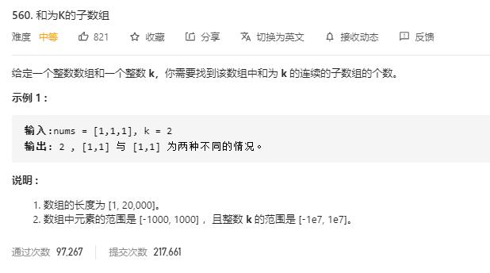

# subarray_sum_equals_k

## 题目截图
 

## 思路 前缀和

前缀和概念： 即前 n 项和,故连续数组 [i, j] = S(j)  - s(i - 1)

故可维持一个哈希表,以前缀和为键，出现次数为值，保存前缀和

    class Solution:
    def subarraySum(self, nums: List[int], k: int) -> int:
        # 计算以 j 结尾的和为 k 的连续字数组个数
        # 前缀和概念： 即前 n 项和,故连续数组 [i, j] = S(j)  - s(i - 1)
        # 故可维持一个哈希表,以前缀和为键，出现次数为值，保存前缀和
        dic, pre, res = {}, 0, 0
        for num in nums:
            if pre not in dic:
                dic[pre] = 1
            else:
                dic[pre] += 1
            tmp = pre + num
            pre = tmp
            if tmp - k in dic:
                res += dic[tmp - k]
        return res

