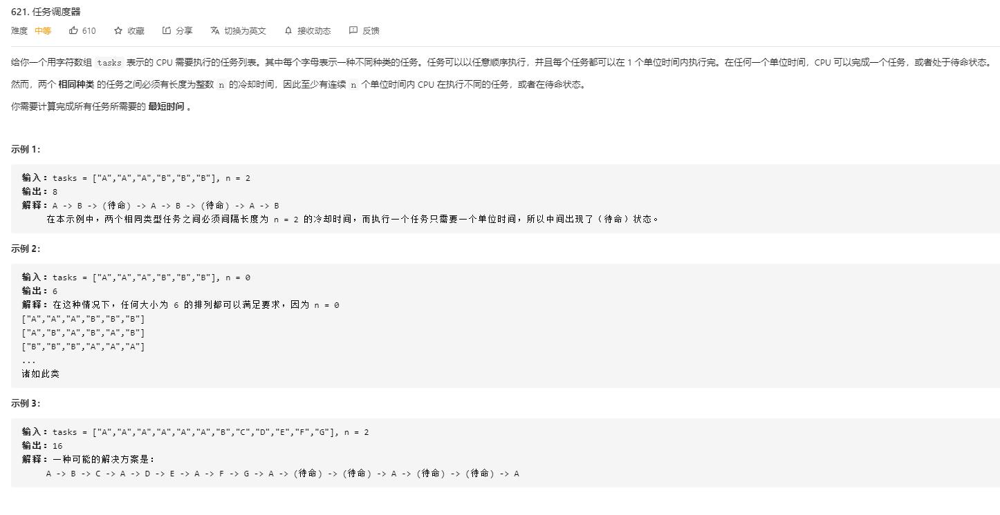

# task_scheduler

## 题目截图
 

## 思路 桶子
参考 [桶思想](https://leetcode-cn.com/problems/task-scheduler/solution/tong-zi-by-popopop/)

    class Solution:
    def leastInterval(self, tasks: List[str], n: int) -> int:
        # 使用字典保存
        # 键为任务，值为任务数量
        dic = {}
        for task in tasks:
            if task not in dic:
                dic[task] = 1
            else:
                dic[task] += 1
        # most 记录最长的任务数，x 指最长任务数的个数
        most, x = 0, 0
        for key in dic:
            if dic[key] > most:
                most = dic[key]
                x = 1
            elif dic[key] == most:
                x += 1
        return max(len(tasks), (most - 1) * (n + 1) + x)
