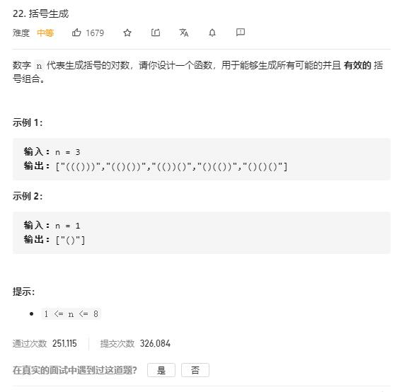

# generate_parentheses

## 题目截图
 

## 思路一 回溯

    class Solution:
    def generateParenthesis(self, n: int) -> List[str]:
        # 回溯,参数为当前字符串列表，左括号、右括号数量
        def backtrack(s, left, right):
            if len(s) == 2 * n:
                res.append(''.join(s))
            if left < n:
                s.append('(')
                backtrack(s, left + 1, right)
                s.pop()
            if left >right:
                s.append(')')
                backtrack(s, left, right + 1)
                s.pop()
        res = []
        backtrack([], 0, 0)
        return res
