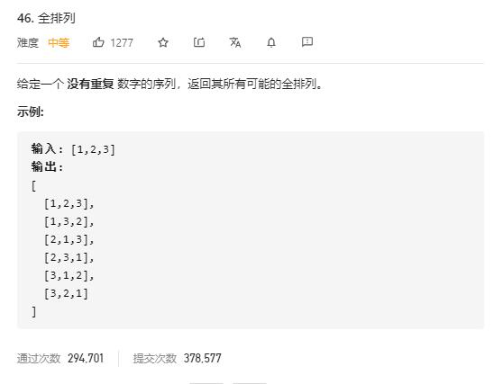

# permutations

## 题目截图
 

## 思路 回溯

    class Solution:
    def permute(self, nums: List[int]) -> List[List[int]]:
        def dfs(nums, visited, tmp):
            if len(tmp) == len(nums):
                res.append(tmp[:])
                return
            for i in range(len(nums)):
                if not visited[i]:
                    visited[i] = True
                    tmp.append(nums[i])
                    dfs(nums, visited, tmp)
                    visited[i] = False
                    tmp.pop()
        visited = [False for _ in range(len(nums))]
        res = []
        dfs(nums, visited, [])
        return res

