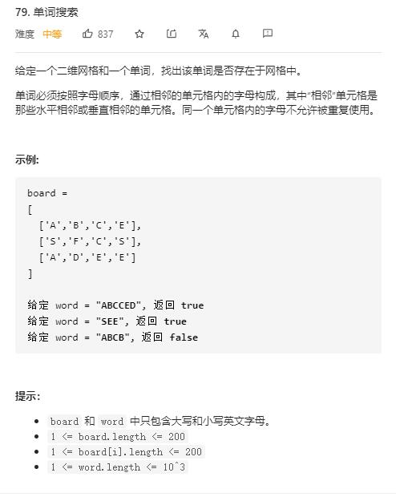

# word_search

## 题目截图
 

## 思路 回溯

- 设置辅助数组 `visited` 来记录当前元素是否被访问
- 终止条件：
    - `word`访问完
    - 到达数组边界

- 时间复杂度：`O(M * N * 3^L)`，`L` 为 `word` 长度
- 空间复杂度: `O(M * N)`，辅助二维数组

    class Solution:
    def exist(self, board: List[List[str]], word: str) -> bool:
        # 回溯
        # 设置一个辅助二维数组
        row, col = len(board), len(board[0])
        visited = [[0 for _ in range(col)] for _ in range(row)]
        def recur(index, i, j):
            # 终止条件
            if index >= len(word):
                return True
            if i < 0 or i >= row or j < 0 or j >= col or visited[i][j]:
                return False
            if word[index] == board[i][j]:
                visited[i][j] = 1
                res = recur(index + 1, i - 1, j) or recur(index + 1, i + 1, j) or recur(index + 1, i, j - 1) or recur(index + 1, i, j + 1)
                visited[i][j] = 0
                return res
        for i in range(row):
            for j in range(col):
                if recur(0, i, j):
                    return True
        return False

