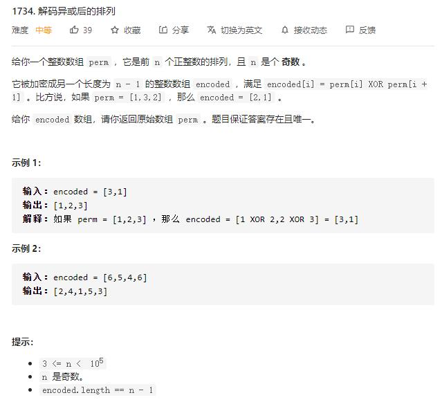

# decode_XORed_permutation

## 题目截图
 

## 思路 位运算

使用异或运算

异或运算性质：

1.相同数值异或，结果为`0`
2.任意数字与 `0` 进行异或， 结果为数值本身
3.异或本身满足交换律

由题目可知 `encoded[i] = arr[i] XOR arr[i + 1]`, 将等式两边同时异或 `arr[i]`，可得：
`encoded[i] XOR arr[i] = arr[i] XOR arr[i + 1] XOR arr[i]`
==>  **`encoded[i] XOR arr[i] = arr[i + 1]`**

所以知道了第一个` arr[0]` 及 `encoded` 数组，即可得到整个原数组

同样利用性质可求出 `arr[0]`

    
    class Solution:
    def decode(self, encoded: List[int]) -> List[int]:
        n = len(encoded) + 1
        s1, s2 = 0, 0
        for i in range(n):
            s1 ^= (i + 1)
        # 只取 encoded 中的偶数位置上的数字异或和
        for i in range(n // 2):
            s2 ^= encoded[i * 2 + 1]
        first = s1 ^ s2
        res = [first]
        for num in encoded:
            first ^= num
            res.append(first)
        return res

