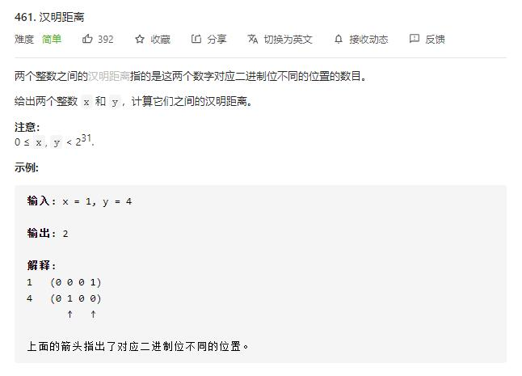

# hamming_distance

## 题目截图
 

## 思路 位运算

使用异或运算

    
    class Solution:
    def hammingDistance(self, x: int, y: int) -> int:
        s, res = x ^ y, 0
        while s:
            if s & 1:
                res += 1
            s >>= 1
        return res
