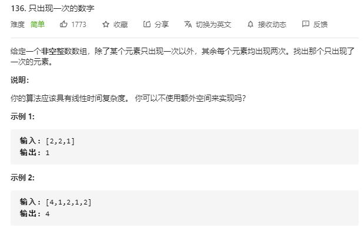

# single_number

## 题目截图
 

## 思路 位运算

使用异或运算

    
    class Solution:
        def singleNumber(self, nums: List[int]) -> int:
            res = 0
            for num in nums:
                res ^= num
            return res
