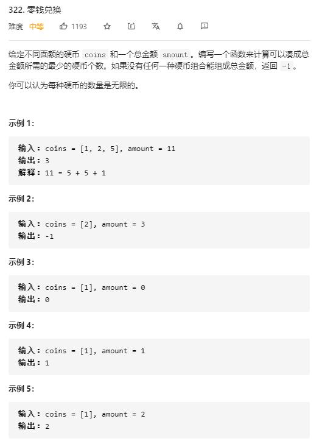

# coin_change

## 题目截图
 

## 思路一 动态规划

    class Solution:
    def coinChange(self, coins: List[int], amount: int) -> int:
        # dp[i] 代表 i 元的最少硬币数
        dp = [float("inf")] * (amount + 1)
        dp[0] = 0
        for i in range(1, amount + 1):
            flag = True
            for coin in coins:
                if coin > i or dp[i - coin] == -1:
                    continue

                dp[i] = min(dp[i - coin] + 1, dp[i])
                flag = False
            if flag:
                dp[i] = -1
        return dp[-1]

