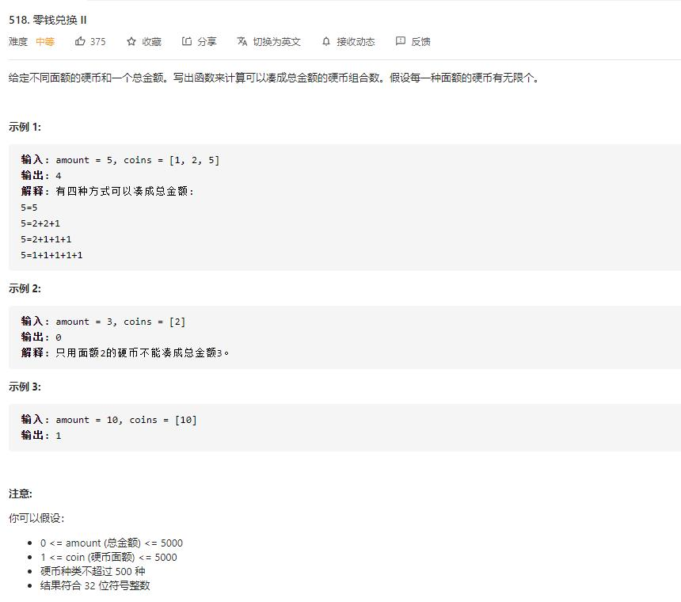

# coin_change_2

## 题目截图
 

## 思路一 动态规划

背包问题，循环为：

    for num in nums:
        for j in range(target + 1, -1, -1):
            dp[j] += dp[j - num]

完全背包问题与 `0-1` 背包问题的不同是元素可以重复用，其循环为：

    for num in nums:
        for j in range(num, target + 1):
            dp[j] += dp[j - num]

两者区别在于背包问题使用 `dp[i - 1][j - num]`, 而完全背包问题使用 `dp[i][j - num]`

即一个只使用之前的 `num`, 一个使用的包括当前的 `num`。

    class Solution:
    def change(self, amount: int, coins: List[int]) -> int:
        dp, n = [0] * (amount + 1), len(coins)
        # 面额为 0 有一种组合数
        dp[0] = 1
        for i in range(n):
            for j in range(coins[i], amount + 1):
                dp[j] += dp[j - coins[i]]
        return dp[-1]
                

