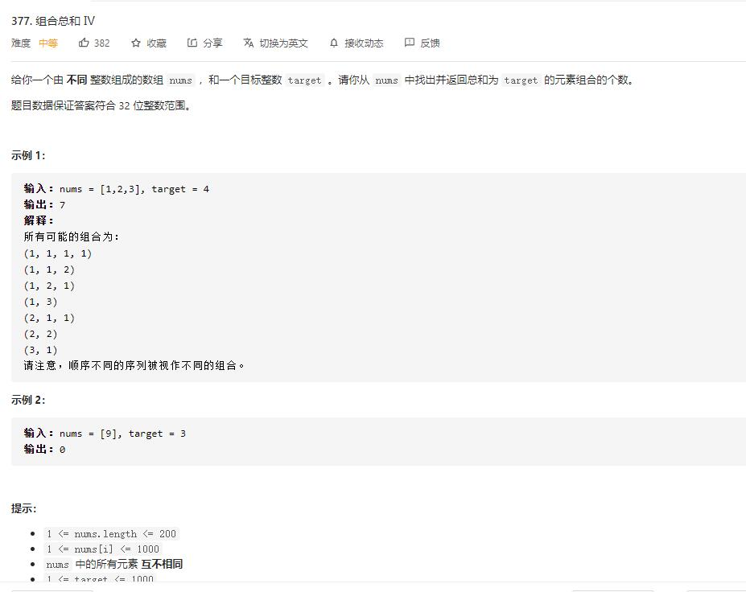

# combination_sum_IV

## 题目截图
 

## 思路一 动态规划

    class Solution:
    def combinationSum4(self, nums: List[int], target: int) -> int:
        # 采用 动态规划，有顺序的背包问题
        dp = [0] * (target + 1)
        dp[0] = 1
        for i in range(target + 1):
            for num in nums:
                if i >= num:
                    dp[i] += dp[i - num]
        return dp[-1]
