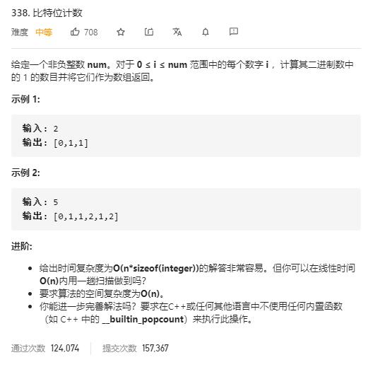

# counting_bits

## 题目截图
 

## 思路一 动态规划

- 奇数：其 `1` 的个数为右移后 `1` 个数 `+ 1`
- 偶数：其 `1` 的个数为右移后 `1` 个数 `+ 0`
- 综合：`dp[i] = dp[i >> 1] + (i & 1)`

    class Solution:
    def countBits(self, num: int) -> List[int]:
        dp = [0] *(num + 1)
        for i in range(1, num + 1):
            dp[i] = dp[i >> 1] + (i & 1)
        return dp
