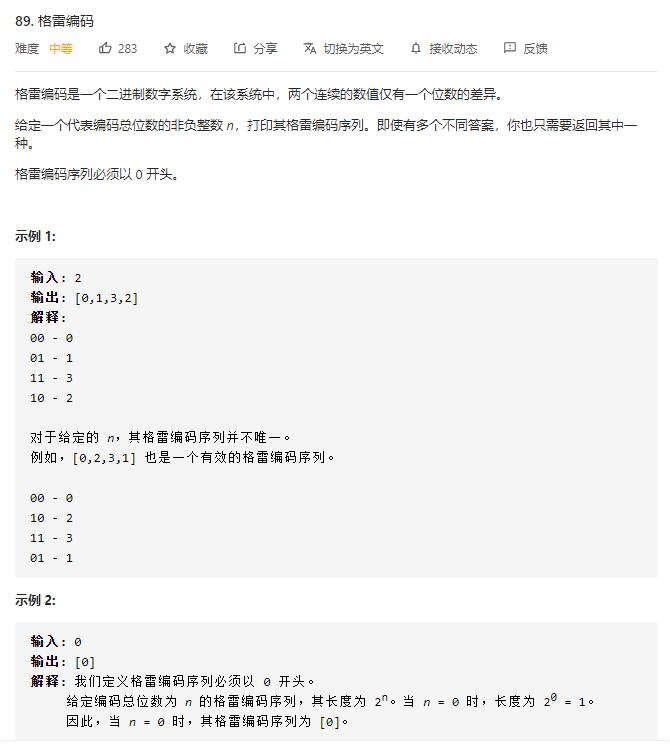

# gray_code

## 题目截图
 

## 思路一 动态规划

[大佬思路](https://leetcode-cn.com/problems/gray-code/solution/gray-code-jing-xiang-fan-she-fa-by-jyd/)

    class Solution:
    def grayCode(self, n: int) -> List[int]:
        # dfs
        res, head = [0], 1
        for i in range(n):
            for j in range(len(res) - 1, -1, -1):
                res.append(head + res[j])
            head <<= 1
        return res
