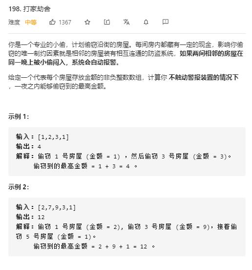

# house_robber

## 题目截图
 

## 思路一 动态规划

    class Solution:
    def rob(self, nums: List[int]) -> int:
        # 动态规划
        # s[i], n[i] 分别代表偷与不偷当前房屋的最大值,结果返回其中较大者
        # s[i], n[i]  = n[i - 1] + nums[i], max(s[i - 1], n[i - 1])
        # 初始状态： s[0], n[0] = nums[0], 0
        if not nums:
            return 0
        a, b = nums[0], 0
        for i in range(1, len(nums)):
            a, b = b + nums[i], max(a, b)
        return max(a, b)
