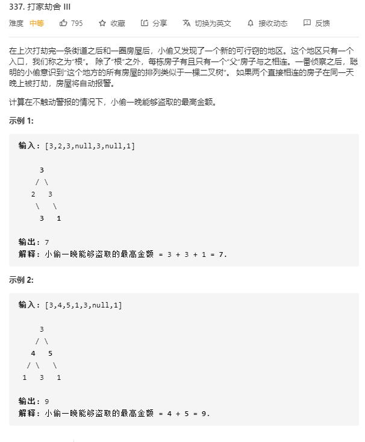

# house_robber_III

## 题目截图
 

## 思路一 动态规划

- 状态即该节点偷与不偷
- 深度遍历，从下面节点开始确定偷与不偷的值，从而确定父节点偷与不偷的最大值

- 时间复杂度：O(n),每个节点都遍历一遍
- 空间复杂度：O(n),栈

    # Definition for a binary tree node.
    # class TreeNode:
    #     def __init__(self, val=0, left=None, right=None):
    #         self.val = val
    #         self.left = left
    #         self.right = right
    class Solution:
        # 深度遍历
        def rob(self, root: TreeNode) -> int:
            def dfs(node):
                if not node:
                    return 0, 0
                ly, ln = dfs(node.left)  # ly代表左边偷最大，ly代表左边不偷最大
                ry, rn = dfs(node.right)
                # 返回该点偷与不偷的最大值
                return node.val + ln + rn, max(ly, ln) + max(ry, rn)
            return max(dfs(root))
