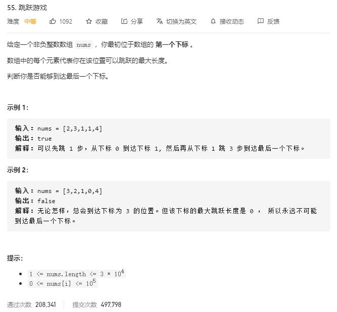

# Two_Sum

## 题目截图
 

## 思路一 动态规划
- `f[i]` 代表它能不能跳到第i个位置
- 状态转移方程：只要前面有一个位置能到达该位置即可到达

    class Solution:
    def canJump(self, nums: List[int]) -> bool:
        # 经典的动态规划问题
        # 最后一步，即假设它能跳到
        # f[i] 代表它能不能跳到第i个位置
        # 初始状态： f[0] = True
        dp = [False] * len(nums)
        dp[0] = True 
        for i in range(1, len(nums)):
            for j in range(i):
                if dp[j] and i <= j + nums[j]:
                    dp[i] = True
                    break
        return dp[-1]

- 时间复杂度： `O(N^2), 1 + 2 + 3 + ... + n`
- 空间复杂度： `O(N)`

## 思路二 遍历

只需遍历数组，维持一个变量 `last` 指代当前能跳到的最远距离，`last = max(last, i + nums[i])`，遍历过程中若最远距离 `>= n - 1` 即可 `return True`,否则返回`False`。

    class Solution:
        def canJump(self, nums: List[int]) -> bool:
            n, last = len(nums), 0
            for i in range(n):
                if last >= i:
                    last = max(last, i + nums[i])
                    if last >= n - 1:
                        return True
            return False
