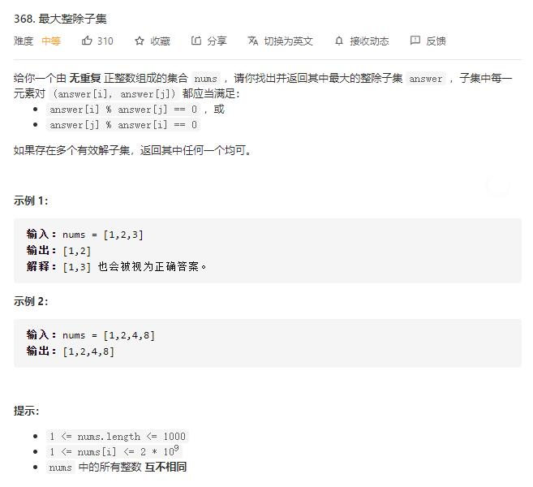

# largest_divisible_subset

## 题目截图
 

## 思路一 动态规划

    class Solution:
        def largestDivisibleSubset(self, nums: List[int]) -> List[int]:
            # 先排序，然后就是一个动态规划问题
            # f[i], g[i] 分别代表以 i 结尾的最长整数子集长度和 i 的前一位
            # 此题类似于最长递增子序列,只不过它能接在后面的条件是能被前一位
            nums.sort()
            n = len(nums)
            f, g = [0] * n, [0] * n
            for i in range(n):
                length, prev = 1, i
                for j in range(i):
                    if nums[i] % nums[j] == 0:
                        if f[j] + 1 > length:
                            length = f[j] + 1
                            prev = j
                f[i] = length
                g[i] = prev
            # 遍历f[i]，获得最大长度及其下标
            max_length = index = -1 
            for i in range(n):
                if f[i] > max_length:
                    max_length = f[i]
                    index = i
    
            # 使用 g[] 数组回溯出具体方案
            res = []
            while len(res) < max_length:
                res.append(nums[index])
                index = g[index]
            res.reverse()
            return res

