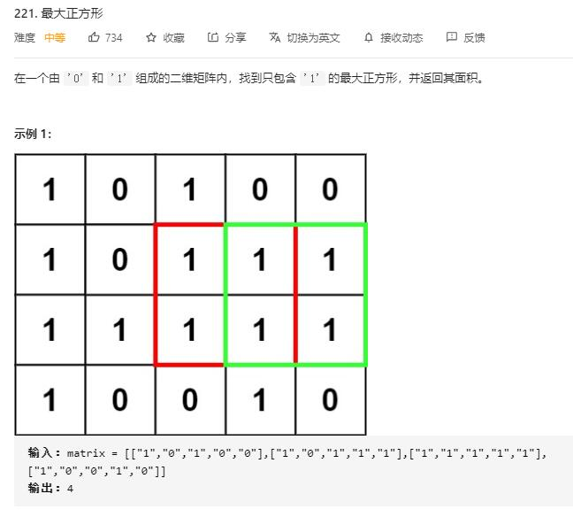

# maximal_square

## 题目截图
 

## 思路一 暴力解法

    class Solution:
    def maximalSquare(self, matrix: List[List[str]]) -> int:
        # 暴力
        m, n = len(matrix), len(matrix[0])
        res = 0
        for i in range(m):
            for j in range(n):
                if matrix[i][j] == '1':
                    res = max(res, 1)
                    cur_max = min(m - i, n - j)
                    for k in range(1, cur_max):
                        flag = True
                        # 先检查右下角
                        if matrix[i + k][j + k] == '0':
                            break
                        # 再检查增加的不包括右下角的元素
                        for x in range(k):
                            if matrix[i + k][j + x] == '0' or matrix[i + x][j + k] == '0':
                                flag = False
                                break
                        if flag:
                            res = max(res, k + 1)
                        else:
                            break
        return res * res

## 思路二 动态规划

    class Solution:
        def maximalSquare(self, matrix: List[List[str]]) -> int:
            # 动态规划
            # dp[i][j] 代表以 matrix[i][j] 为右下角的正方形最大边长
            # 转移方程：
            # dp[i][j] = min(dp[i - 1][j],dp[i][j - 1], dp[i - 1][j - 1]) + 1
            # 边界条件：第一行第一列若 matrix[i][j] == '1'，则 dp[i][j] = 1
            row, column, res = len(matrix), len(matrix[0]), 0
            dp = [[0 for _ in range(column)] for _ in range(row)]
            for i in range(row):
                for j in range(column):
                    if matrix[i][j] == '1':
                        if i == 0 or j == 0:
                            dp[i][j] = 1
                        else:
                            dp[i][j] = min(dp[i - 1][j], dp[i][j - 1], dp[i - 1][j - 1]) + 1
                        res = max(res, dp[i][j])
            return res * res
