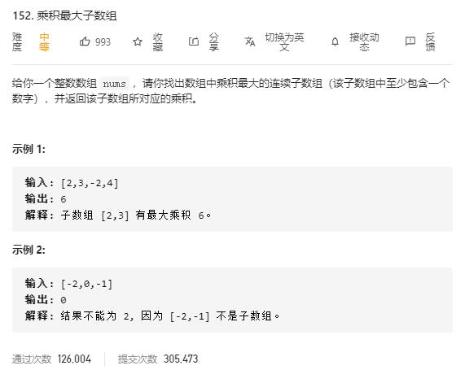

# maximum_product_subarray

## 题目截图
 

## 思路一 动态规划
- 若没有负数则直接使用 `imax` 记录**以当前元素结尾**的乘积最大子数组即可，此题含负数，故还需变量 `imin`来记录乘积最小子数组的值
- 遇到负数，最大值变最小值，最小值变最大值。

    class Solution:
    def maxProduct(self, nums: List[int]) -> int:
        # 动态规划
        # imax, imin 代表以 i - 1 个元素结尾的最大值最小值
        # 但由于存在负数，所以需维持最大值与最小值，遇到负数时最大值与最小值互换
        res, imax, imin = float("-inf"), 1, 1
        for num in nums:
            if num < 0:
                imax, imin = imin, imax
            imax = max(imax * num, num)
            imin = min(imin * num, num)
            res = max(res, imax)
        return res

 