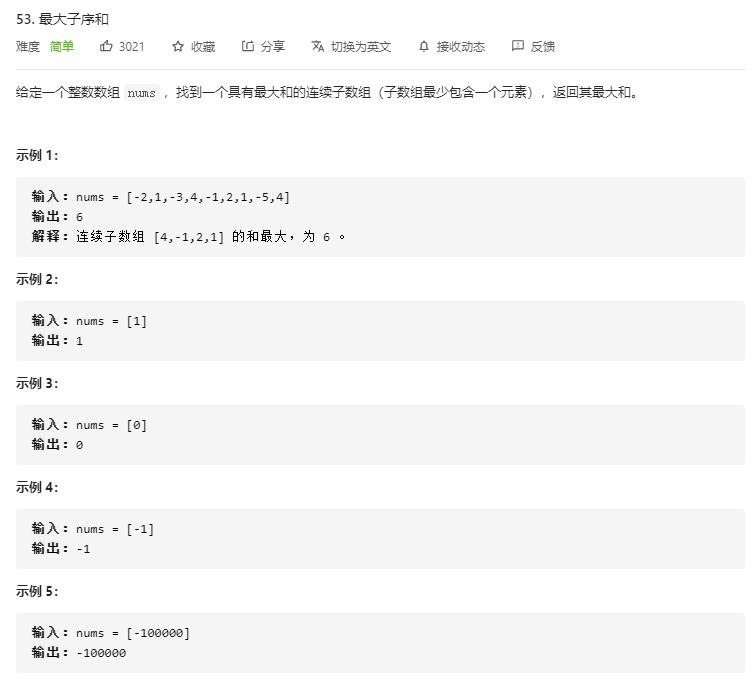

# maximum_subarray

## 题目截图
 

## 思路一 动态规划
- 状态 `dp[i]`  代表以第 `i` 个元素结尾的最大和
- 状态转移方程：
`if dp[i - 1] <= 0: dp[i] = nums[i]
 else: dp[i] = nums[i] + dp[i - 1]`

    class Solution:
    def maxSubArray(self, nums: List[int]) -> int:
        # 动态规划
        # dp[i] 为以第 i 个元素结尾的最大连续和
        # 转移方程： if dp[i - 1] <= 0: dp[i] = nums[i]
        # else: dp[i] = nums[i] + dp[i - 1]
        # 只需两个变量，res, former
        res, former = nums[0], nums[0]
        for i in range(1, len(nums)):
            if former <= 0:
                res = max(nums[i], res)
                former = nums[i]
            else:
                former += nums[i]
                res = max(former, res)
        return res

