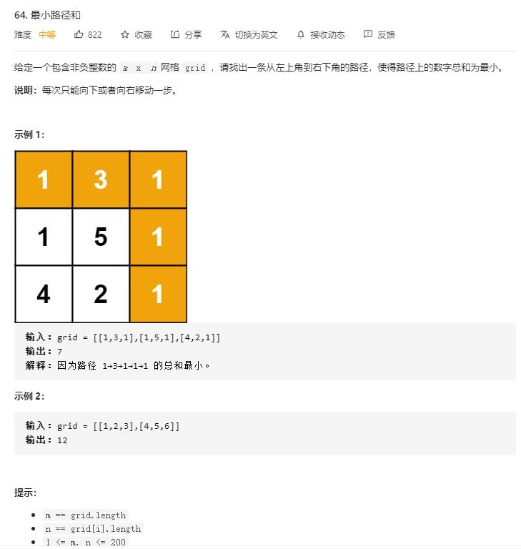

# minimum_path_sum

## 题目截图
 

## 思路 动态规划
- 状态 `dp[i][j]`  代表以到达该位置的最小和
- 状态转移方程：`dp[i][j] = min(dp[i][j - 1], dp[i - 1][j]) + grid[i][j]`
- 初始条件：`dp[0][0] = grid[0][0]`
- 边界条件：第一行和第一列路径只有一条

    class Solution:
    def minPathSum(self, grid: List[List[int]]) -> int:
        # 动态规划
        # dp[i][j] 表示到达该点的最小路径和
        # 初始条件：dp[0][0] = grid[0][0]
        # 边界条件：第一行和第一列
        m, n = len(grid), len(grid[0])
        dp = [[0 for _ in range(n)] for _ in range(m)]
        dp[0][0] = grid[0][0]
        for i in range(1, n):
            dp[0][i] = dp[0][i - 1] + grid[0][i]
        for j in range(1, m):
            dp[j][0] = dp[j - 1][0] + grid[j][0]
        for i in range(1, m):
            for j in range(1, n):
                dp[i][j] = min(dp[i][j - 1], dp[i - 1][j]) + grid[i][j]
        return dp[-1][-1]

