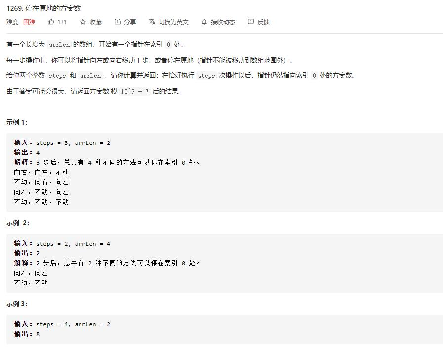

# number_of_ways_to_stay_in_the_same_place_after_some_steps

## 题目截图
 

## 思路 动态规划

    class Solution:
    def numWays(self, steps: int, arrLen: int) -> int:
        # 动态规划 d
        # 最后一步可能来自于右边向左移动一步，或者原地不动
        # dp[i][s] 代表从0到达索引 i 处经过 s 步的方案数
        # dp[0][1] = 1
        # 转移方程:
        # dp[i][j] = dp[i - 1][j - 1] + dp[i][j - 1] + dp[i + 1][j - 1]
        if arrLen == 1 or steps == 0: return 1
        # 因为最远能走 steps // 2 步才能回来，此时一共 steps + 1 列
        max_len = min(arrLen, steps // 2 + 1)  
        dp = [0] * max_len
        m = 10 ** 9 + 7
        # 初始化,因为初始状态就在 0 点，故经过 0 步到达 0 的方案数为1
        dp[0] = 1
        for i in range(steps):
            dp2 = [0] * max_len
            for j in range(max_len):
                dp2[j] = dp[j]
                if j > 0:
                    dp2[j] = (dp2[j] + dp[j - 1]) % m
                if j < max_len - 1:
                    dp2[j] = (dp2[j] + dp[j + 1]) % m
            dp = dp2
        return dp[0]