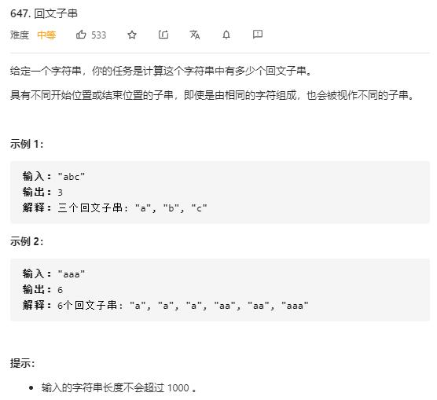

# palindromic_substrings

## 题目截图
 

## 思路 动态规划

    class Solution:
    def countSubstrings(self, s: str) -> int:
        # 动态规划
        # 定义状态： dp[i][j]代表由元素 [i, j] 组成的字符串是否为回文，其可根据 dp[i + 1][j - 1] 判断
        # 边界条件， 若 i j 之间元素小于2 个，则中间子串为回文子串
        res, length = 0, len(s)
        dp = [[False for _ in range(length)] for _ in range(length)]
        for j in range(length):
            # 加上一个字符的子串
            dp[j][j] = True
            res += 1
            for i in range(j):
                if s[i] == s[j]:
                    if j - i < 3 or dp[i + 1][j - 1]:
                        res += 1
                        dp[i][j] = True
        return res

