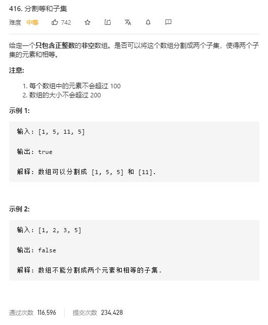

# partition_equal_subset_sum

## 题目截图
 

## 思路一 动态规划

即是在数组中找到子数组使其恰好等于和的一半

所以可转化为 0-1 背包 问题

    class Solution:
    def canPartition(self, nums: List[int]) -> bool:
        s = 0
        for num in nums:
           s += num
        if s & 1:
            return False
        s //= 2
        dp = [False] * (s + 1)
        dp[0]= True
        for i in range(len(nums)):
            for j in range(s, 0, -1):
                if j < nums[i]:
                    break
                if dp[j - nums[i]]:
                    dp[j] = True
        return dp[-1]
