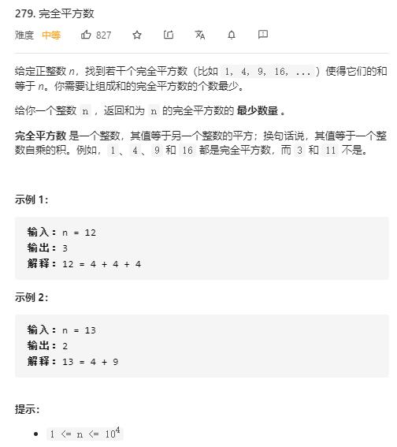

# maximum_subarray

## 题目截图
 

## 思路一 动态规划

    class Solution:
        def numSquares(self, n: int) -> int:
            # 动态规划
            nums = [i ** 2 for i in range(1, int(sqrt(n) + 1))]
            dp = [float("inf")] * (n + 1)
            dp[0] = 0  # 表示刚好为完全平方数
            for i in range(1, n + 1):
                for num in nums:
                    if i < num:
                        break
                    dp[i] = min(dp[i], dp[i - num] + 1)
            return dp[-1]