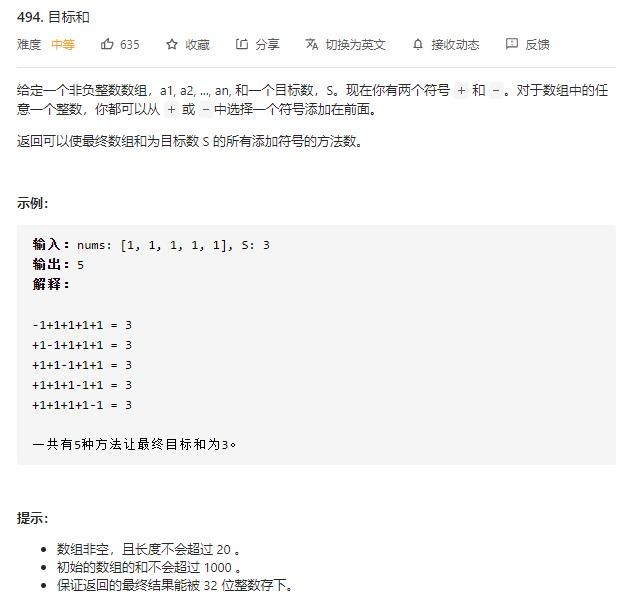

# target_sum

## 题目截图
 

## 思路 动态规划
背包问题
不过上下限不同
需找到其对应关系
- `dp[i][j]` 代表使用前 `i` 个数的和为 `j` 的方法数
- 首先确定最大的和 `s` , 则可使用 `j = 2 * s + 1` 长度数组来保存各个和的方法数
- 数值 `x` 对应数组中序号索引为 `s + x`
- 初始化第一个数的方法数，考虑到 `0` 的存在，故使用叠加而不是直接 `dp[0][s + nums[0]], dp[0][s - nums[0]] = 1, 1`
- 考虑边界情况，加入 `nums[i]` 后其对应相加的 `dp[i-1][j - nums[i]]` 和 `dp[i - 1][j + nums[i]]`，判断 `j - nums[i]` 与 `j + nums[i]` 是否越界，不越界则相加
- 空间可只使用两个数组优化

    class Solution:
    def findTargetSumWays(self, nums: List[int], target: int) -> int:
        # 背包问题，动态规划
        # dp[j] 代表和为 j 的方法数
        s = 0
        for num in nums:
            s += num
        if abs(target) > s:
            return 0
        dp = [[0] * (s * 2 + 1) for _ in range(len(nums))]
        dp[0][s + nums[0]] += 1
        dp[0][s - nums[0]] += 1
        for i in range(1, len(nums)):
            for j in range(2 * s + 1):
            # 判断是否越界，不越界则相加
                if j >= nums[i]:
                    dp[i][j] += dp[i - 1][j - nums[i]]
                if j + nums[i] <= 2 * s:
                    dp[i][j] += dp[i - 1][j + nums[i]]
        return dp[-1][s + target]

