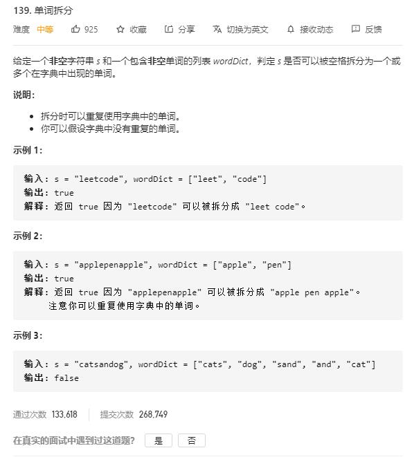

# word_break

## 题目截图
 

## 思路一 动态规划

    class Solution:
    def wordBreak(self, s: str, wordDict: List[str]) -> bool:
        # 动态规划
        # dp[j] 代表以第 j 个字符结尾的字符串是否能拆分为字典中出现的单词
        # dp[j] = dp[i] and s[i : j + 1] in wordDict
        # 注意其中的开闭情况，i 是从 0 到 n - 1, 即遍历完所有字符
        # j 是从 i + 1 到 n, 但截取的字符 是 [i, j)
        n = len(s)
        dp = [False] * (n + 1)
        dp[0] = True
        for i in range(n):
            for j in range(i + 1, n + 1):
                if dp[i] and s[i:j] in wordDict:
                    dp[j] = True
        return dp[-1]

    # 带剪枝版
    class Solution:
    def wordBreak(self, s: str, wordDict: List[str]) -> bool:
        # 动态规划带剪枝版，
        # j 从后往前
        n, max_word = len(s), 0
        dp = [False] * (n + 1)
        dp[0] = True
        for word in wordDict:
            max_word = max(max_word, len(word))
        for i in range(1, n + 1):
            low = max(i - max_word - 1, -1)
            for j in range(i - 1, low, -1):
                if dp[j] and s[j:i] in wordDict:
                    dp[i] = True
                    break
        return dp[n]
        
## 思路二 DFS

    class Solution:
        def wordBreak(self, s: str, wordDict: List[str]) -> bool:
            # DFS
            # 返回以第 i 个字符开头的字符串是否可以拆分
            n = len(s)
            memo = [None] * n 
            def dfs(i, n):
                if i >= n:
                    return True
                if memo[i] != None:
                    return memo[i]
                for j in range(i + 1, n + 1):
                    if s[i:j] in wordDict and dfs(j, n):
                        memo[i] = True
                        return True
                memo[i] = False
                return False
            return dfs(0, n)
            