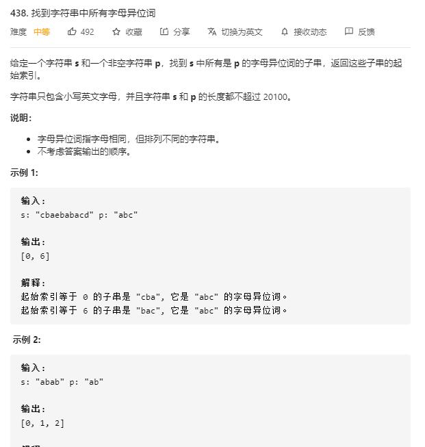

# find_all_anagrams_in_a_string

## 题目截图
 

## 思路一 列表哈希表 + 滑动窗口

使用列表充当哈希表

由于是小写英文字母，所以最多只含26个 

故使用包含26个数字的列表来记录每个字母的个数

若当前窗口的列表与目标列表相同，则将下标加入结果列表

    class Solution:
    def findAnagrams(self, s: str, p: str) -> List[int]:
        length_s, length_p, res = len(s), len(p), []
        if length_p > length_s:
            return res
        # 使用列表记录各字母出现的次数
        p_dic = [0] * 26
        s_dic = [0] * 26
        for i in range(length_p):
            p_dic[ord(p[i]) - ord('a')] += 1
            s_dic[ord(s[i]) - ord('a')] += 1
        if p_dic == s_dic:
            res.append(0)
        for i in range(length_s - length_p):
            s_dic[ord(s[i]) - ord('a')] -= 1
            s_dic[ord(s[i + length_p]) - ord('a')] += 1
            if p_dic == s_dic:
                res.append(i + 1)
        return res
