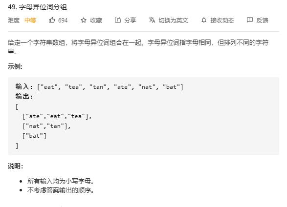

# group_anagrams

## 题目截图
 

## 思路 排序 + 哈希表
将各词排序，然后通过字典加到相应列表中去

    
    class Solution:
        def groupAnagrams(self, strs: List[str]) -> List[List[str]]:
            dic = collections.defaultdict(list)
            for word in strs:
                dic[''.join(sorted(word))].append(word)
            
            return list(dic.values())
