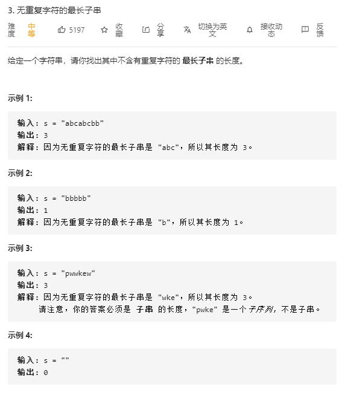

# longest_substring_without_repeating_characters

## 题目截图
 

## 思路 动态规划 + 哈希表

    class Solution:
    def lengthOfLongestSubstring(self, s: str) -> int:
        # 使用哈希表记录字符最后出现的位置
        # 动态规划，cur表示以当前字符结尾的最长子串长度
        dic = {}
        res, cur= 0, 0
        for i in range(len(s)):
            if s[i] not in dic:
                cur += 1 
            else:
                cur = min(i - dic[s[i]], cur + 1)
            dic[s[i]] = i
            res = max(res, cur)
        return res
