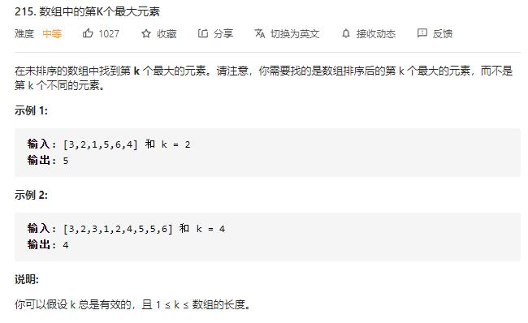

# Kth_largest_element_in_an_array

## 题目截图
 

## 思路 堆

首先初始化一个`k`个元素小根堆，然后遍历剩余元素，若大于堆顶元素则入堆，最终小根堆为数组中最大的`k`个元素
- 时间复杂度：O(nlogk)，建堆时间复杂度 klogk，之后最差为 n 次 logk
- 空间复杂度：O(logk)

    class Solution:
    def findKthLargest(self, nums: List[int], k: int) -> int:
        heap_size = len(nums)
        self.build_min_heap(nums, k)
        for i in range(k, heap_size):
            if nums[i] > nums[0]:
                self.swap(nums, 0, i)
                self.min_heaplify(nums, 0, k)
        return nums[0]
    
    def build_min_heap(self, nums, heap_size):
        for i in range((heap_size - 1) // 2, -1, -1):
            self.min_heaplify(nums, i, heap_size)

    def min_heaplify(self, nums, i, heap_size):
        l, r, minimum = 2 * i + 1,2 * i + 2, i
        if l < heap_size and nums[l] < nums[minimum]:
            minimum = l
        if r < heap_size and nums[r] < nums[minimum]:
            minimum = r
        if minimum != i:
            self.swap(nums, i, minimum)
            self.min_heaplify(nums, minimum, heap_size)

    def swap(self, nums, i, j):
        nums[i], nums[j] = nums[j], nums[i]
        
## 思路二 快排

    import random

    class Solution:
        def findKthLargest(self, nums: List[int], k: int) -> int:
            n = len(nums)
            target, res, left, right = n - k, -1, 0, n - 1
            while res != target:
                res = self.partition(nums, left, right)
                if res < target:
                    left = res + 1
                elif res > target:
                    right = res - 1
            return nums[res]
    
        def partition(self, nums, left, right):
            r = random.randint(left, right)
            nums[left], nums[r] = nums[r], nums[left]
            i, j = left, right
            while i < j:
                while i < j and nums[j] >= nums[left]: j -= 1
                while i < j and nums[i] <= nums[left]: i += 1
                nums[i], nums[j] = nums[j], nums[i]
            nums[left], nums[i] = nums[i], nums[left]
            return i
        