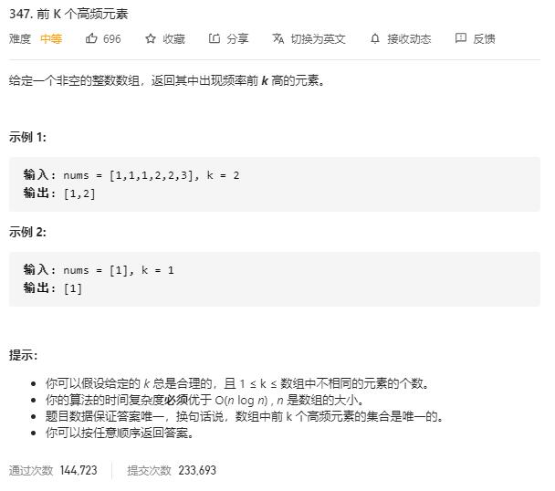

# top_k_frequent_elements

## 题目截图
 

## 思路 哈希 + 堆

    class Solution:
    def topKFrequent(self, nums: List[int], k: int) -> List[int]:
        # 使用字典
        dic = {}
        for num in nums:
            if num not in dic:
                dic[num] = 1
            else:
                dic[num] += 1
        tmp = heapq.nlargest(k, dic.items(), key = lambda item: item[1])
        res = []
        for item in tmp:
            res.append(item[0])
        return res