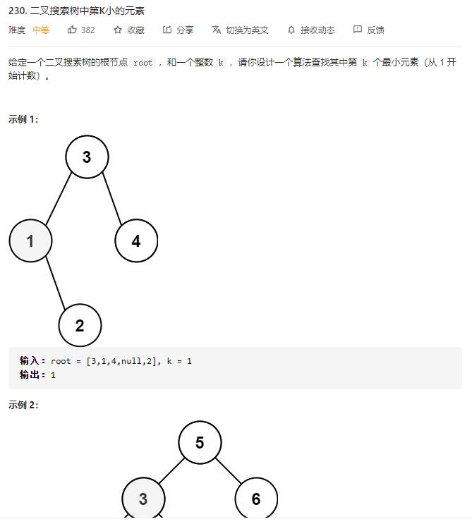

# Kth_smallest_element_in_a_BST

## 题目截图
 

## 思路 DFS
 

    # Definition for a binary tree node.
    # class TreeNode:
    #     def __init__(self, val=0, left=None, right=None):
    #         self.val = val
    #         self.left = left
    #         self.right = right
    class Solution:
        def kthSmallest(self, root: TreeNode, k: int) -> int:
            # dfs
            def find_k(node):
                if not node:
                    return []
                return find_k(node.left) + [node.val] + find_k(node.right) 
            return find_k(root)[k - 1]

## 思路二 迭代

    # Definition for a binary tree node.
    # class TreeNode:
    #     def __init__(self, val=0, left=None, right=None):
    #         self.val = val
    #         self.left = left
    #         self.right = right
    class Solution:
        def kthSmallest(self, root: TreeNode, k: int) -> int:
            # 递归
            stack = []
            while True:
                while root:
                    stack.append(root)
                    root = root.left
                root = stack.pop()
                if k == 1:
                    return root.val
                k -= 1
                root = root.right
