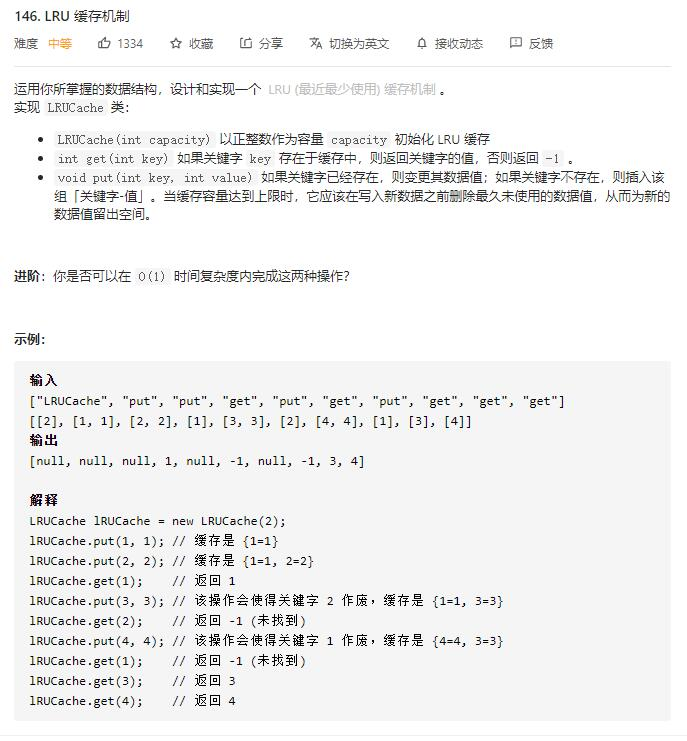

# LRU_cache

## 题目截图
 

## 思路一 HashMap

使用双向链表保存

使用字典保存节点
 

    
    class DLinkedNode:

    def __init__(self, key=0, value=0):
        self.key = key
        self.value = value
        self.prev = None
        self.next = None
    
    
    class LRUCache:
    
        def __init__(self, capacity: int):
            # 使用队列来保存
            # 建立虚拟头尾节点
            self.dic = {}
            self.head = DLinkedNode()
            self.tail = DLinkedNode()
            self.head.next = self.tail
            self.tail.prev = self.head
            self.capacity = capacity
            self.size = 0
    
        def get(self, key: int) -> int:
            if key not in self.dic:
                return -1
            else:
                node = self.dic[key]
                self._remove_node(node)
                self._add_head(node)
                return node.value
    
    
        def put(self, key: int, value: int) -> None:
            if key in self.dic:
                node = self.dic[key]
                node.value = value
                self._remove_node(node)
                self._add_head(node)
            else:
                node = DLinkedNode(key = key, value = value)
                self.dic[key] = node
                self._add_head(node)
                self.size += 1
                if self.size > self.capacity:
                    node = self._remove_tail()
                    self.dic.pop(node.key)
                    self.size -= 1
                
    
        
        def _remove_node(self, node):
            node.next.prev = node.prev
            node.prev.next = node.next
    
    
        def _add_head(self, node):
            self.head.next.prev = node
            node.next = self.head.next
            self.head.next = node
            node.prev = self.head
    
    
        def _remove_tail(self):
            node = self.tail.prev
            self._remove_node(node)
            return node
    
    
        # Your LRUCache object will be instantiated and called as such:
        # obj = LRUCache(capacity)
        # param_1 = obj.get(key)
        # obj.put(key,value)

